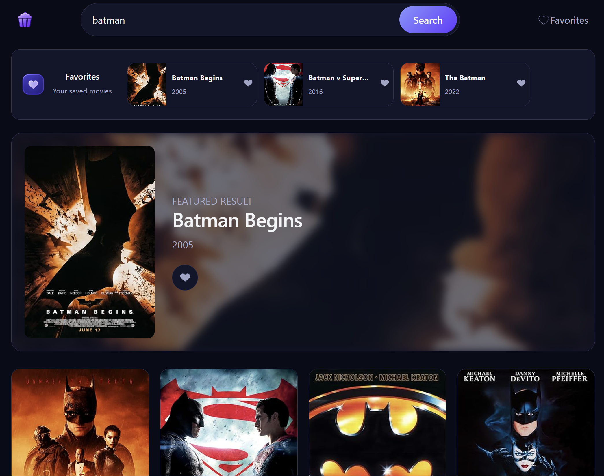

# Movie Explorer

A movie search app built with React, TypeScript, and Vite using the OMDb API.

I created this as a learning project to practice React components, state, props, API requests, and responsive CSS layouts.

## Features

- Search for movies by title.
- View a featured result with a poster backdrop.
- Browse additional search results.
- Add and remove favorites.
- View saved movies in a horizontal favorites strip.
- Display loading, error, and empty-result messages.

Favorites are stored in React state and reset when the page reloads.

## Tech Stack

- React
- TypeScript
- Vite
- CSS
- OMDb API

## Getting Started

1. Clone the repository.
2. Install dependencies:

   npm install

3. Create a `.env` file in the project root and add your OMDb API key:

   VITE_OMDB_KEY=your_api_key_here

4. Start the development server:

   npm run dev

## What I Practiced

- Splitting the interface into reusable components.
- Passing data and callbacks through props.
- Managing search results and favorites with useState.
- Fetching data and handling loading and error states.
- Using conditional rendering.
- Styling layouts with Flexbox and CSS Grid.
- Adding hover effects and active navigation styles.

## Future Improvements

- Save favorites with localStorage.
- Improve the layout on smaller screens.
- Add pagination for more search results.

